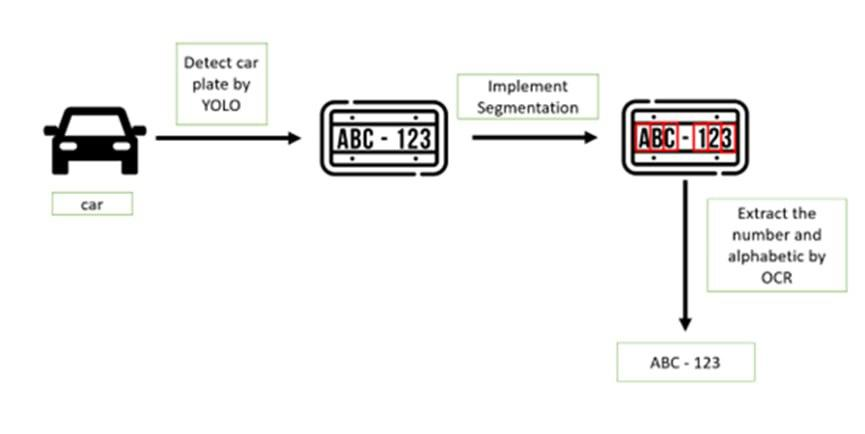

# Egyptian-Licence-Plate-OCR

This project focuses on Optical Character Recognition (OCR) for Egyptian license plates using advanced deep learning techniques. It leverages object detection models, optical character recognition tools, and various data processing libraries to achieve accurate recognition and parsing of license plate characters.

## Table of Contents
- [Project Overview](#project-overview)
- [Requirements](#requirements)
- [Installation](#installation)
- [Results](#results)
- [File Descriptions](#file-descriptions)
- [Contributing](#contributing)
- [License](#license)

## Project Overview

`Egyptian-Licence-Plate-OCR` is designed to detect and recognize Egyptian license plates using state-of-the-art models and libraries. It combines object detection and OCR pipelines to achieve high accuracy, making it suitable for various applications such as traffic monitoring, access control, and smart city solutions.

## Requirements

The project depends on the following Python packages:

- `ultralytics==8.0.114`  
- `pandas==2.0.2`  
- `opencv-python==4.7.0.72`  
- `numpy==1.24.3`  
- `scipy==1.10.1`  
- `easyocr==1.7.0`  
- `filterpy==1.4.5`  

Ensure you have Python 3.8 or later installed.

## Installation

1. Clone the repository:
   ```bash
   git clone https://github.com/boss-error/Egyptian-Licence-Plate-OCR.git
   cd Egyptian-Licence-Plate-OCR
   ```

2. Set up a virtual environment (recommended):
   ```bash
   python -m venv env
   source env/bin/activate  # On Windows: env\Scripts\activate
   ```

3. Install dependencies:
   ```bash
   pip install -r requirements.txt
   ```

## Results

### Architecture Overview



### Accuracy Metrics


The model achieves high accuracy on Egyptian license plate datasets with robust performance across various lighting conditions and image quality levels.

### Demo

A demo video explaining the workflow and results can be found here: [Explain Video](explain.mkv).

## File Descriptions

- `arch.jpg`: An image depicting the overall model architecture.
- `accuracy.jpg`: An image showing accuracy statistics and metrics.
- `explain.mkv`: A video file that explains the model workflow and results.
- `main.py` (if available): Main script to execute the OCR pipeline.
- `requirements.txt`: List of dependencies needed for the project.

## Contributing

Contributions are welcome! Please open an issue first to discuss what you would like to change. 

## License

This project is licensed under the [MIT License](LICENSE).
